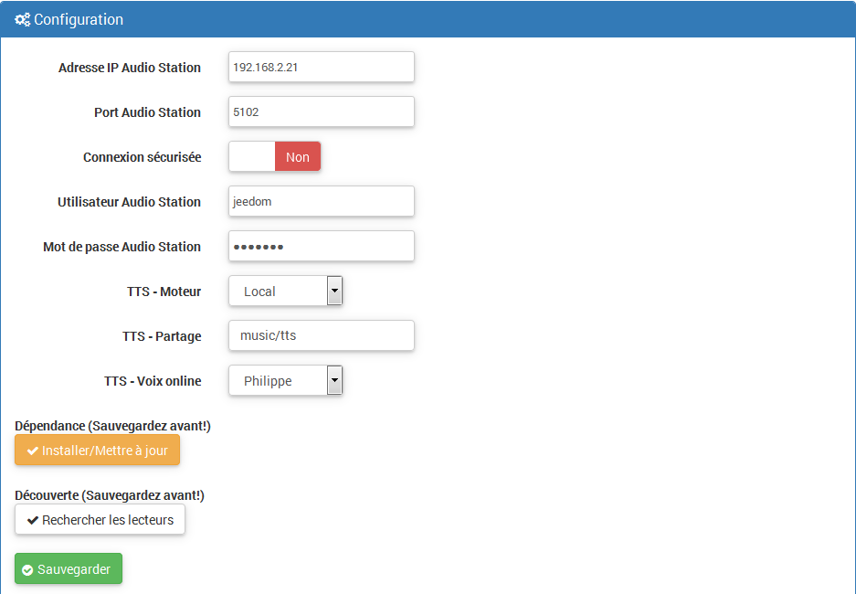
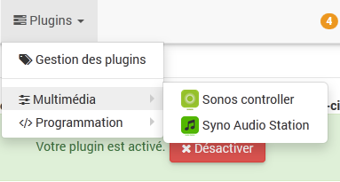
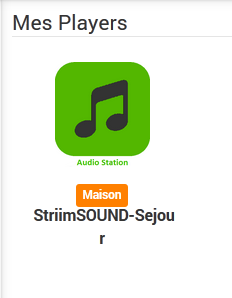
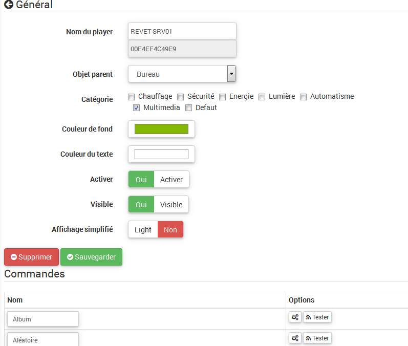
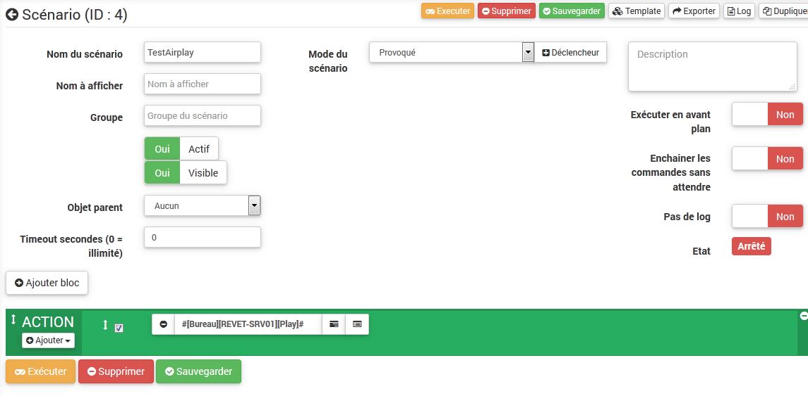
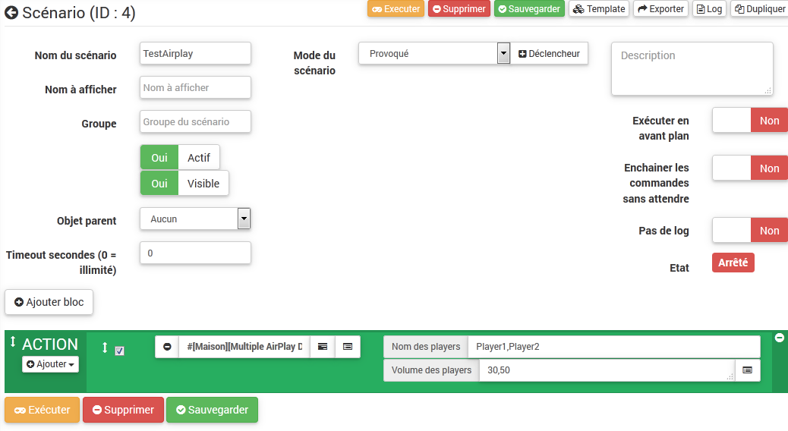
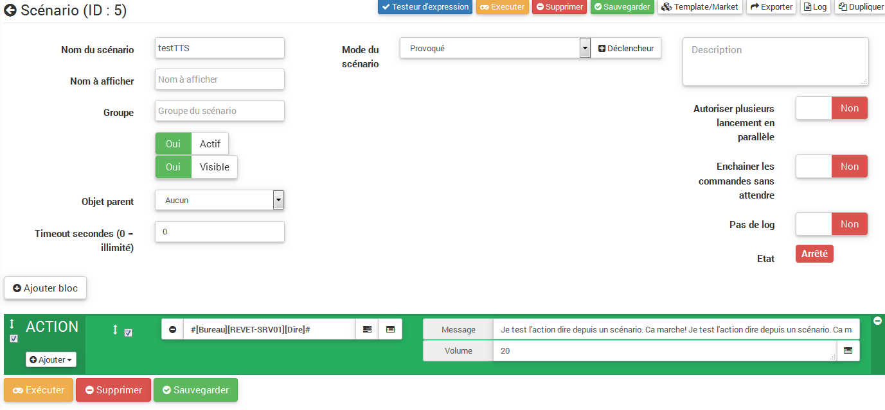

The Synoaudio plugin allows you to connect to your nas and control Audio Station as well as your compatible players. It will allow you to see the status of a player and perform actions on it (play, pause, next, previous, volume, choice of a playlist ...)

Configuration =============

After downloading the plugin, activate it:

 

Renseignez l'adresse IP ou DNS et le port de votre nas hébergeant Synology AudioStation, l'utilisateur et le mot de passe pour se connecter. Le mode sécurisé permet de passer les requêtes en https (Verifier que le port soit bien le port https). 

Ensuite rendez-vous dans l'onglet du plugin pour affecter pour lancer une découverte des lecteurs compatibles avec AudioStation.(Veillez à ce que vos lecteurs soient allumés pour qu'ils soient découverts) et vous pourrez affecter un objet(pièce) à vos lecteurs et sauvegardez.

Configuration des équipements
-----------------------------

La configuration des players est accessible à partir du menu plugin : 

Voilà à quoi ressemble la page du plugin (ici avec déjà 1 player) : 

Affectez un objet (pièce) à vos lecteurs (si ce n'est pas fait en automatique), une couleur (si besoin) et le type d'affichage. Ensuite ,sauvegardez.

> **Tip**
>
> Les lecteurs s'activent ou se désactivent automatiquement en fonction de 
> leur disponibilités, la tuile se grise et devient inerte.

Intégration dans un scénario 
----------------------------

Toute les actions sont disponibles via scénario, exemple : 

Cas particulier pour le lecteur "Multiple AirPlay Devices"  l'action "Multiple Player" est disponible. Elle permet d'ajouter des players en multiroom et d'ajuster leur volume.

Fonction TTS
------------

La fonction TTS est disponible via scénario, commande 'Dire', elle permet de faire parler Jeedom via le plugin.

Le plugin limite le message à 400 caractères pour le moteur Local et à 100 caractères pour le moteur Online.

Ordres particuliers
-------------------

Dans les scénarios, vous avez accès a des commandes particulières : 
    -> 'Ordre' : Permet de demander a jeedom de chercher et de mettre en lecture un artitiste ou un album en fonction d'un ou plusieurs mots (Attention à l'orthographe).
    -> 'Tache' : Permet de réduire la charge de jeedom et du NAS en stoppant la tache programmé (cron).

> **Tip**
>
> Il est possible d'ajouter une temporisation pour la remise en état du lecteur :
> Dans le champs 'Volume' mettre [Volume]|[Temporisation]. Exemple d'un volume 45 
> et une temporisation de 10 seconde : 45|10 .

FAQ
===

* Lenteur de jeedom et/ou du Nas depuis que le plugin est installé :  
Le plugin fait des appels réguliers au nas pour remonter toutes les informations utiles. Il est possible de modifier le paramètre de la tache planifiée, Général -> Administration -> Moteur de tâches et sur la tâche synoaudio, pull : changer la valeur dans la colonne Démon (Valeur en secondes, c'est l'intervalle entre deux taches).

* J'ai configurer mon plugin mais j'ai l'erreur "200 : SyntaxError: Unexpected end of input" :  
C'est une erreur générique, il faut aller dans l'onglet logs de Jeedom pour avoir plus de détail.
Plusieurs pistes peuvent être explorer :   
    - Vérifier que votre utilisateur / mot de passe soient corrects,
    - Vérifier les droits de votre utilisateur sur votre nas . l'utilisateur doit avoir tous les droits dans AudioStation.

* Le TTS met longtemps à répondre :  
Le nombre action nécessaire au plugin pour énoncer un message est importante.
En voici un extrait : 
    - Création du message (la durée dépend de sa longueur)
    - Transfert du message sur le réseau.
    - Mise en lecture du fichier (beaucoup de requête faite à Audio Station)

* Le plugin ne se met plus a jour : 
Avec la prise en charge de la double auth il sepeu que le plugin perde la connexion au NAS. Il faut se rendre sur la page de configuration du plugin (mettre à jour les informations de connexion si besoin) et sauvegarder la configuration. 

